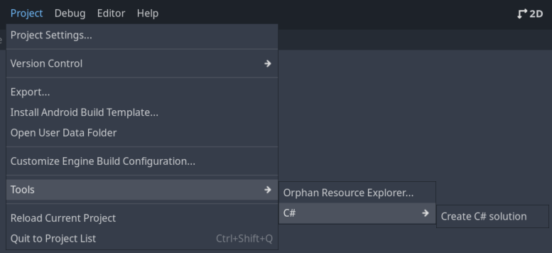
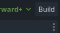
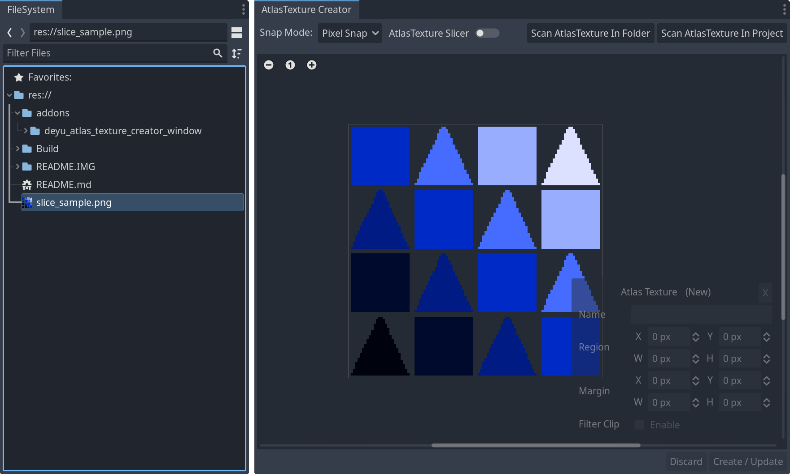
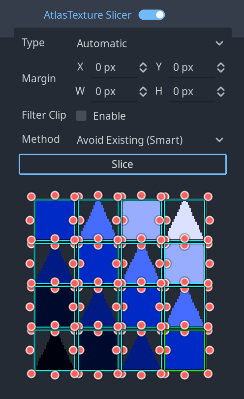
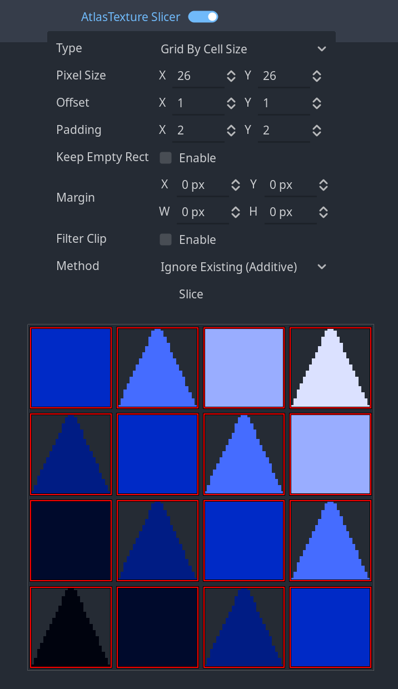
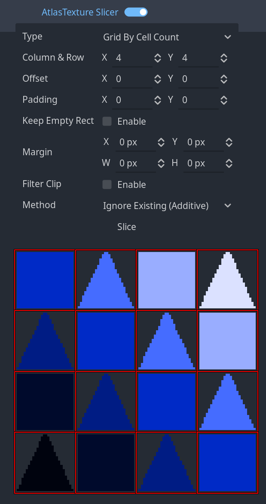
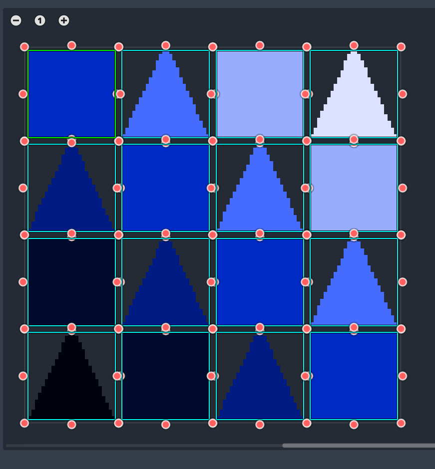
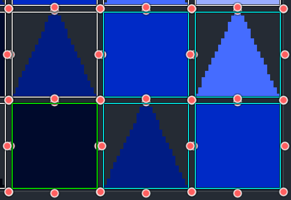
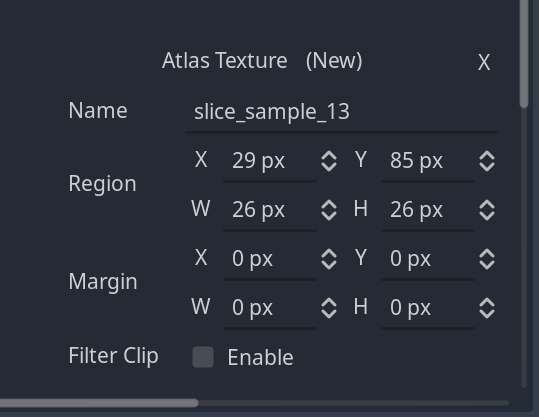

# GD-AtlasTexture-Creator

## English

Supports `Godot 4.1/4.2 With .Net`
Based on .Net, `GD AtlasTexture Creator` provides a handy editor window that resembles the `SpriteEditor` from UnityEditor for ease of `AtlasTexture` creation.

### Installation

0. Configure the .Net runtime according to the `Prerequisites` section of the [Godot Engine Docs](https://docs.godotengine.org/en/stable/tutorials/scripting/c_sharp/c_sharp_basics.html).

1. Download the zip file from [Release](https://github.com/Delsin-Yu/GD-AtlasTexture-Creator/releases/download/1.0.1/GD-AtlasTexture-Creator.1.0.1.zip).

2. Decompress the file, and place the `addons` folder directly into the root of your project.

3. If you have not yet create a C# solution, select `Project/Tools/C#/Create C# solution`, then click the `Build` button at top right corner.

4. Navigate to `Project/Project Settings/Plugins` in Godot Editor, locate the `GD AtlasTexture Creator` from the `Installed Plugins` list, and then check `Enable` under the `Status` column.

5. The dedicated inspector for `GD AtlasTexture Creator` will now launch located at the `Bottom Right Dock slot`

### Usage

#### Inspecting a Texture

When double-clicking a resource with type `Texture2D` inside the `FileSystem Window`, the `GD AtlasTexture Creator` will show the preview of the inspecting image.

#### Top Bar Section

Control|Description|Selections
:-|:-|:-
`Snap Mode`|Controls the `snapping precision` when editing rect parameters, similar to the options inside the `AtlasTexture Region Editor Window`.|`Pixel Snap`: All Editing Metrics are clamped to integer precision. `None`: All Editing Metrics are clamped to two digits.
`AtlasTexture Slicer`|Toggle the visibility of the `AtlasTexture Slicer`, a tool for automating AtlasTexture creation.|`On`: Displays the `AtlasTexture Slicer` `Off`: Hides the `AtlasTexture Slicer`
`Scan AtlasTexture Button`|Scan the eligible `AtlasTextures` which uses the current inspecting `Texture2D` and displays the result inside the viewport.|`Scan AtlasTexture In Folder`: Scan the eligible AtlasTextures in the directory where the current inspecting `Texture2D` is located. `Scan AtlasTexture In Project`: Scan the eligible AtlasTextures everywhere inside the project.

#### Slicer Subview Section

A powerful tool for creating AtlasTexture slices, there are three slicing types provided as follows.
Slice Type|Description|Preview
:-|:-|:-
Automatic|Create AtlasTexture slices based on pixel chunks inside the texture, this is identical to the behavior found in the `AtlasTexture Region Editor Window`.|
Grid By Cell Size|Create AtlasTexture slices based on the specified cell pixel size.|
Grid By Cell Count|Create AtlasTexture slices based on the specified cell count.|

When creating AtlasTexture slices using this tool, there are two `Methods` of creating slices available.
Method Name|Description
:-|:-
Ignore Existing (Additive)|Create the slices directly, and ignore the current existing slices.
Avoid Existing (Smart)|New AtlasTexture slices that have their region occupied by existing AtlasTextures, will be ignored during the creation.

#### Primary View Section

This is the primary section for editing `AtlasTexture Slices`.
Similar to the `AtlasTexture Region Editor Window`, you can drag the viewport by holding the middle mouse button, and scale the viewport by scrolling the middle mouse button or through the buttons on the top left corner.

Mouse Action|Description
:-|:-
`Left Click` and `Drag` in the empty section of the area|Create a new AtlasTexture from the texture & identify the sizing.
`Left Click` and `Drag` on the handle (Red Circle)|Modify the `Size` of an existing AtlasTexture
`Left Click` and `Drag` inside an existing AtlasTexture Slice|Modify the `Position` of an existing AtlasTexture

The `AtlasTextures` created are `Color Coded` as following

Color|Definition
:-|:-
`Green`|Current selected `AtlasTexture`.
`White`|The `AtlasTexture` from the project.
`Cyan`|The temporarily created `AtlasTexture`, you can `edit their name` or `delete these slices` since they are not written into the filesystem.

#### AtlasTexture Mini Inspector

Displays the `Edible Parameters` for the current selected `AtlasTexture`

Control|Description
:-|:-
`X`|`Remove` the selected `AtlasTexture`, only available for `temporarily` created AtlasTextures.
`Name`|Edit the `Name` of the selected `AtlasTexture`, only available for `temporarily` created AtlasTextures.
`Region`|Edit the `Region` of the selected `AtlasTexture`.
`Margin`|Edit the `Margin` of the selected `AtlasTexture`.
`Filter Clip`|Edit the `Filter Clip` property of the selected `AtlasTexture`.

#### Save & Discard Section

All changes made to the inspecting texture are `not` written into the filesystem immediately, this section is used to `apply` or `discard` the pending modification.

Button|Definition
:-|:-
`Discard`|Discard the pending modification and restore the `Primary View Section` to its initial state.
`Create / Update`|Creates all `temporarily created AtlasTextures`, and applies all changes to `existing AtlasTextures` into the project filesystem.

## 中文

此插件支持 `包含.Net模块的Godot 4.1/4.2`  
基于 .Net，`GD AtlasTexture Creator` 提供一个类似于Unity编辑器中`Sprite编辑器`的实用的编辑器，用于简化`AtlasTexture`的创建过程。

### 安装

0. 根据 [Godot Engine Docs](https://docs.godotengine.org/en/stable/tutorials/scripting/c_sharp/c_sharp_basics.html) 中 `Prerequisites` 一栏的内容配置 .Net 运行时。

1. 从[Release](https://github.com/Delsin-Yu/GD-AtlasTexture-Creator/releases/download/1.0.1/GD-AtlasTexture-Creator.1.0.1.zip)处下载压缩包。

2. 解压下载完成的压缩包，并且将其中的`addons`文件夹放置在项目工程文件夹的根目录。

3. 如果从未建立过C#解决方案，则执行 `Project/Tools/C#/Create C# solution` ，之后点击窗口右上角的 `Build`。

4. 前往Godot编辑器的`项目/项目设置.../插件`，从`已安装插件`列表中找到`GD AtlasTexture Creator`项目，然后将`状态`一列中的`启用`栏目勾上

5. `GD AtlasTexture Creator`专用的检查器将会启动于编辑器的`右下停靠栏`

### 使用

#### 检视一个材质

在`文件系统窗口`中双击一个`Texture2D`类型的资源时，`GD AtlasTexture Creator`会展示当前正在检视的图像资源

#### 顶栏

控件|介绍|选项信息
:-|:-|:-
`吸附模式`|控制编辑矩形时的`对齐精度`，类似于`AtlastTexture 区域编辑器`中的同名控件。|`像素吸附`：所有编辑时的参数都对齐到最近整数。 `无`：所有编辑时的参数都对齐到最近两位小数。
`AtlasTexture Slicer`|切换`AtlasTexture Slicer`可见性，一种用于自动化创建AtlasTexture的工具。|`On`: 显示`AtlasTexture Slicer` `Off`: 隐藏`AtlasTexture Slicer`
`Scan AtlasTexture Button`|扫描引用了当前`Texture2D`的`AtlasTextures`并且在视图中展示。|`Scan AtlasTexture In Folder`: 在当前`Texture2D`所在的文件夹中扫描符合条件的AtlasTextures。 `Scan AtlasTexture In Project`: 在整个项目文件夹中扫描符合条件的AtlasTextures。

#### 切片器

用于创建AtlasTexture切片的工具，提供了三种切片类型，如下所示。
切片模式|介绍|预览
:-|:-|:-
Automatic|基于纹理内部的像素块创建AtlasTexture切片，这与`AtlasTexture区域编辑器窗口`中的行为相同。|
Grid By Cell Size|根据指定的单元格像素大小创建AtlasTexture切片。|
Grid By Cell Count|基于指定的单元计数创建AtlasTexture切片。|

使用此工具创建AtlasTexture切片时，有两种创建切片的`方法`可用。
方法名称|介绍
:-|:-
Ignore Existing (Additive)|直接创建切片，并忽略当前的现有切片。
Avoid Existing (Smart)|区域被现有AtlasTextures占据的新AtlasTexture切片将在创建过程中被忽略。

#### 主视图界面

这是编辑`AtlasTexture切片`的主要部分。
与`AtlasTexture区域编辑器窗口`类似，可以通过按住鼠标中键拖动视口，并通过滚动鼠标滚轮或通过左上角的按钮缩放视口。

鼠标动作|介绍
:-|:-
在区域的空白区域中`单击`并`拖拽`|从纹理创建一个新的AtlasTexture并确定大小。
在`缩放手柄`上`拖拽`（红色圆圈）|修改现有AtlasTexture的`大小`
在现有AtlasTexture切片内`拖拽`|修改现有AtlasTexture的`位置`

创建的`AtlasTextures`是`按照颜色区分`的，如下所示

颜色|定义
:-|:-
`绿`|当前选定的`AtlasTexture`。
`白`|项目资源中的`AtlasTexture`。
`青`|临时创建的`AtlasTexture`，你可以`编辑它们的名称`或`删除这些切片`，因为它们没有写入文件系统。

#### AtlasTexture迷你检查器

显示当前选定`AtlasTexture`的`可编辑参数`

控件|介绍
:-|:-
`X`|`删除`选定的`AtlasTexture`，仅适用于`临时`创建的AtlasTextures。
`Name`|编辑所选`AtlasTexture`的`名称`。
`Region`|编辑所选`AtlasTexture`的`Region`属性。
`Margin`|编辑所选`AtlasTexture`的`Margin`属性。
`Filter Clip`|编辑所选`AtlasTexture`的`Filter Clip`属性。

#### 保存&丢弃按钮分区

对检查纹理所做的所有更改都不会立即`写入`文件系统，此部分用于`应用`或`放弃`挂起的修改。

按钮|介绍
:-|:-
`Discard`|放弃挂起的修改并将`主视图界面`恢复到其初始状态。
`Create / Update`|创建所有`临时创建的AtlasTextures`，并将对`现有的AtlasTextures`的所有更改应用到项目文件系统中。
